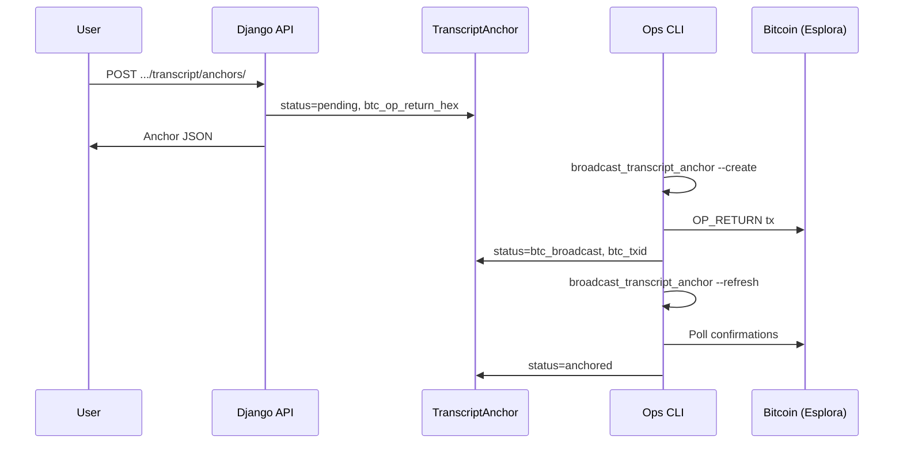

# Transcript certification (Bitcoin OP_RETURN)

Certify a content transcript by anchoring its SHA-256 `text_hash` in a Bitcoin
`OP_RETURN` output. Anyone with the plain text can recompute the hash and check
it against the on-chain payload (and explorer).

**No EVM / smart-contract path.** Certification is Bitcoin-only.

**Implementation**

| Layer | Location |
|-------|----------|
| Model | `TranscriptAnchor` in `acbc_app/content/models.py` |
| API | `acbc_app/content/views_transcript_anchor.py` |
| Broadcast | `acbc_app/content/bitcoin/` + `manage.py broadcast_transcript_anchor` |
| UI | `frontend/src/content/ContentBitcoinAnchor.jsx` |
| Env | [`BTC_*`](../deployment/environment-variables.md#bitcoin-op_return-transcript-anchoring) |

Prerequisite: a `ContentTranscript` with a non-empty `text_hash` (usually from
[transcript ingest](transcript-ingest.md)).

---

## OP_RETURN payload

```
ASCII prefix "ACBC1"  +  32-byte SHA-256 digest
```

Stored / returned as hex in `btc_op_return_hex` (prefix ASCII bytes + digest).
Default prefix is `ACBC1` (`TranscriptAnchor.DEFAULT_OP_RETURN_PREFIX`).

`text_hash` is the same algorithm as `ContentTranscript.text_hash` (SHA-256 of
normalized transcript text). Rows **snapshot** the hash at certify time so a
later re-ingest can be re-anchored without rewriting history.

Optional `ipfs_cid` is an off-chain pointer only — **not** part of the Bitcoin proof.

---

## Status lifecycle

| Status | Meaning |
|--------|---------|
| `pending` | Row + OP_RETURN payload prepared; not yet broadcast |
| `btc_broadcast` | Tx submitted; waiting for confirmations |
| `anchored` | Enough confirmations (`BTC_MIN_CONFIRMATIONS`, default `1`) |
| `failed` | Build/broadcast/API error (`error_message` set) |



---

## HTTP API

Base path under content details:

| Method | Path | Auth |
|--------|------|------|
| `GET` | `/api/content/content_details/{content_id}/transcript/anchor/` | Public (`AllowAny`). If status is `btc_broadcast`, polls Esplora once and may promote to `anchored`. |
| `POST` | `/api/content/content_details/{content_id}/transcript/anchor/` | Authenticated; uploader or staff. Ensures pending + **broadcasts**. **503** if fee USD &gt; `BTC_MAX_FEE_USD`. |
| `GET`/`POST` | `/api/content/content_details/{content_id}/transcript/anchor-requests/` | Authenticated (any user). Create/pay flow for public `$1` requests → admin review. |
| `GET` | `/api/content/content_details/{content_id}/transcript/anchors/` | Public |
| `POST` | `/api/content/content_details/{content_id}/transcript/anchors/` | Authenticated; uploader or staff |

Public paid requests use `TranscriptAnchorRequest` and a payment method chooser:

- **NOWPayments** — `POST /api/payments/anchor-request/<id>/`
- **BCH directo** — `POST /api/payments/anchor-request/<id>/bch/` + `.../bch/verify/` ([docs](../payments/bch-direct.md))

After payment, status is `paid_pending_review`. Staff approve/reject in Django admin (**Content → Transcript anchor requests**). No automatic refunds.

`POST .../anchors/` **only creates a pending row**.  
`POST .../anchor/` **broadcasts** (platform wallet). The same USD fee cap applies to the ops CLI.

### `GET .../transcript/anchor/` (current)

Returns the anchor matching the **current** transcript hash, or `null`.

```json
{
  "content_id": 101,
  "has_transcript": true,
  "current_text_hash": "a1b2…",
  "current_text_length": 4200,
  "can_certify": true,
  "anchor": { "...": "TranscriptAnchorSerializer or null" }
}
```

### `POST .../transcript/anchor/` (broadcast)

Creates a pending anchor if needed, builds the OP_RETURN tx, and broadcasts unless
the estimated fee exceeds `BTC_MAX_FEE_USD` (default `$1`).

**503** when fees are too high (row stays `pending`):

```json
{
  "error": "Las comisiones por transacción están muy altas por el momento, por favor vuelve a intentarlo más tarde",
  "code": "fee_too_high",
  "fee_sats": 4000,
  "fee_usd": 2.4
}
```

### `GET .../transcript/anchors/` (history)

List of all anchors for that content (including older hashes).

### `POST .../transcript/anchors/` (prepare)

Body (all optional):

| Field | Default | Notes |
|-------|---------|--------|
| `btc_network` | `signet` | `signet`, `testnet`, `mainnet`, `regtest` |
| `op_return_prefix` | `ACBC1` | ASCII prefix |
| `ipfs_cid` | `""` | Off-chain pointer only |

**201** — created. **409** — already exists for current `text_hash` (includes
existing `anchor`). **403** — not uploader/staff. **404** — no transcript.

```bash
curl -X POST "http://localhost:8000/api/content/content_details/101/transcript/anchors/" \
  -H "Authorization: Bearer $ACCESS" \
  -H "Content-Type: application/json" \
  -d '{"btc_network": "signet"}'
```

---

## Ops: broadcast to Bitcoin

Uses a platform P2WPKH wallet (`BTC_PRIVATE_KEY_WIF`) and mempool.space Esplora
(`BTC_API_BASE`). Recommended test network: **signet**.

```bash
# Show platform address (fund via signet faucet first)
docker compose exec backend python manage.py broadcast_transcript_anchor --show-address

# Create pending (if missing) + dry-run (sign, do not broadcast)
docker compose exec backend python manage.py broadcast_transcript_anchor 101 --create --dry-run

# Broadcast
docker compose exec backend python manage.py broadcast_transcript_anchor 101 --create

# Poll confirmations → status=anchored
docker compose exec backend python manage.py broadcast_transcript_anchor 101 --refresh
```

On production stacks that use `docker-compose.prod.yml`, prefix with
`-f docker-compose.prod.yml --env-file .env.compose` as in the rest of the deploy docs.

After changing `requirements.txt` (e.g. adding `embit`), rebuild the backend image
before running these commands.

---

## Verification (manual)

1. Obtain transcript plain text and recompute SHA-256 (same normalization as
   `ContentTranscript`).
2. Compare to `text_hash` / `btc_op_return_hex` (after the `ACBC1` prefix bytes).
3. Open `btc_txid` on mempool.space for the configured network and confirm the
   `OP_RETURN` data matches.

---

## Related

- Env: [environment-variables.md — Bitcoin OP_RETURN](../deployment/environment-variables.md#bitcoin-op_return-transcript-anchoring)
- Transcript ingest: [transcript-ingest.md](transcript-ingest.md)
- Architecture: [blockchain-integration.md](../architecture/blockchain-integration.md)
- Permissions: [endpoint-permissions-map.md](../security/endpoint-permissions-map.md)
- Endpoints index: [endpoints.md](endpoints.md)
