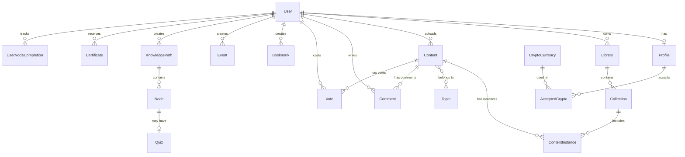

# Data Models

This document describes the database schema and entity relationships for the Sophia.AI Academia Blockchain platform.

## Entity Relationship Overview

## Core Models

### User (Django Built-in)

The base user model from Django's authentication system.

**Fields**:
- `username` - Unique username
- `email` - Email address
- `password` - Hashed password
- `first_name`, `last_name` - User names
- `is_active`, `is_staff`, `is_superuser` - Permission flags

**Relationships**:
- One-to-One with `Profile`
- One-to-Many with `Library`, `Content`, `Comment`, `Vote`, `Bookmark`, `Event`, `KnowledgePath`

### Profile

Extended user profile information.

**Fields**:
- `user` - OneToOneField to User
- `interests` - CharField (max 250)
- `profile_description` - TextField (max 2500)
- `timezone` - CharField (max 30)
- `is_teacher` - BooleanField
- `profile_picture` - ImageField

**Location**: `profiles/models.py`

### Content

Core content model representing educational materials.

**Fields**:
- `uploaded_by` - ForeignKey to User (nullable)
- `media_type` - CharField (choices: VIDEO, AUDIO, TEXT, IMAGE)
- `original_title` - CharField (max 255)
- `original_author` - CharField (max 255)
- `url` - URLField (for URL-based content)
- `topics` - ManyToManyField to Topic
- `created_at` - DateTimeField (auto)

**Methods**:
- `is_url_content` - Property to check if content is URL-based
- `get_vote_count(topic=None)` - Get vote count, optionally filtered by topic
- `get_user_vote(user, topic=None)` - Get user's vote status
- `can_be_modified_by(user)` - Check if user can modify content

**Location**: `content/models.py`

### Library

User's personal collection of content.

**Fields**:
- `user` - ForeignKey to User
- `name` - CharField (max 100)

**Relationships**:
- One-to-Many with `Collection`

**Location**: `content/models.py`

### Collection

Organizes content within a library into categories.

**Fields**:
- `library` - ForeignKey to Library
- `name` - CharField (max 100)

**Relationships**:
- One-to-Many with `ContentInstance`

**Location**: `content/models.py`

### ContentInstance

Represents content as it appears in a specific context (library, topic, etc.).

**Fields**:
- `content` - ForeignKey to Content
- `library` - ForeignKey to Library (nullable)
- `collection` - ForeignKey to Collection (nullable)
- `topic` - ForeignKey to Topic (nullable)
- `title` - CharField (editable title)
- `description` - TextField
- `file` - FileField (for file uploads)
- `created_at`, `updated_at` - DateTimeFields

**Location**: `content/models.py`

### Topic

Categories for organizing content.

**Fields**:
- `name` - CharField (max 100)
- `description` - TextField
- `image` - ImageField
- `created_by` - ForeignKey to User
- `created_at` - DateTimeField

**Relationships**:
- Many-to-Many with `Content`

**Location**: `content/models.py`

## User Interaction Models

### Comment

User comments on content.

**Fields**:
- `user` - ForeignKey to User
- `content` - ForeignKey to Content
- `text` - TextField
- `created_at`, `updated_at` - DateTimeFields
- `parent` - ForeignKey to Comment (for replies, nullable)

**Location**: `comments/models.py`

### Vote

User votes on content.

**Fields**:
- `user` - ForeignKey to User
- `content_type` - ForeignKey to ContentType (generic)
- `object_id` - PositiveIntegerField
- `value` - IntegerField (typically -1, 0, or 1)
- `topic` - ForeignKey to Topic (nullable, for topic-specific votes)
- `created_at` - DateTimeField

**Location**: `votes/models.py`

### VoteCount

Aggregated vote counts for performance.

**Fields**:
- `content_type` - ForeignKey to ContentType
- `object_id` - PositiveIntegerField
- `vote_count` - IntegerField
- `topic` - ForeignKey to Topic (nullable)

**Location**: `votes/models.py`

### Bookmark

User bookmarks for content.

**Fields**:
- `user` - ForeignKey to User
- `content` - ForeignKey to Content
- `created_at` - DateTimeField

**Location**: `bookmarks/models.py`

## Learning Models

### KnowledgePath

Structured learning paths.

**Fields**:
- `title` - CharField
- `description` - TextField
- `created_by` - ForeignKey to User
- `image` - ImageField
- `created_at`, `updated_at` - DateTimeFields

**Relationships**:
- One-to-Many with `Node`

**Location**: `knowledge_paths/models.py`

### Node

Individual steps in a knowledge path.

**Fields**:
- `knowledge_path` - ForeignKey to KnowledgePath
- `title` - CharField
- `description` - TextField
- `content` - ForeignKey to Content (nullable)
- `order` - IntegerField
- `created_at`, `updated_at` - DateTimeFields

**Relationships**:
- One-to-One with `Quiz` (optional)

**Location**: `knowledge_paths/models.py`

### UserNodeCompletion

Tracks user progress through knowledge paths.

**Fields**:
- `user` - ForeignKey to User
- `knowledge_path` - ForeignKey to KnowledgePath
- `node` - ForeignKey to Node
- `is_completed` - BooleanField
- `completed_at` - DateTimeField (nullable)

**Unique Constraint**: (user, knowledge_path, node)

**Location**: `profiles/models.py`

### Quiz

Quizzes associated with knowledge path nodes.

**Fields**:
- `node` - OneToOneField to Node
- `title` - CharField
- `description` - TextField
- `created_at`, `updated_at` - DateTimeFields

**Relationships**:
- One-to-Many with `QuizQuestion`

**Location**: `quizzes/models.py`

## Event Models

### Event

Educational events.

**Fields**:
- `title` - CharField
- `description` - TextField
- `created_by` - ForeignKey to User
- `start_date`, `end_date` - DateTimeFields
- `location` - CharField
- `image` - ImageField
- `created_at`, `updated_at` - DateTimeFields

**Location**: `events/models.py`

## Certificate Models

### Certificate

Blockchain-certified certificates.

**Fields**:
- `user` - ForeignKey to User
- `title` - CharField
- `description` - TextField
- `certificate_file` - FileField
- `blockchain_hash` - CharField (transaction hash)
- `issued_at` - DateTimeField

**Location**: `certificates/models.py`

## Messaging Models

### Message

User-to-user messages.

**Fields**:
- `sender` - ForeignKey to User
- `receiver` - ForeignKey to User
- `content` - TextField
- `read` - BooleanField
- `created_at` - DateTimeField

**Location**: `user_messages/models.py`

## Cryptocurrency Models

### CryptoCurrency

Supported cryptocurrencies.

**Fields**:
- `name` - CharField (unique)
- `code` - CharField
- `thumbnail` - FileField (validated image/SVG)

**Location**: `profiles/models.py`

### AcceptedCrypto

User's accepted cryptocurrency addresses.

**Fields**:
- `user` - ForeignKey to User
- `crypto` - ForeignKey to CryptoCurrency
- `address` - CharField
- `deleted` - BooleanField (soft delete)

**Location**: `profiles/models.py`

## Model Relationships Summary

| Model | Relationships |
|-------|--------------|
| User | 1:1 Profile, 1:N Library/Content/Comment/Vote/Bookmark/Event/KnowledgePath |
| Profile | N:1 User, 1:N AcceptedCrypto |
| Content | N:1 User, M:N Topic, 1:N ContentInstance/Comment/Vote |
| Library | N:1 User, 1:N Collection |
| Collection | N:1 Library, 1:N ContentInstance |
| KnowledgePath | N:1 User, 1:N Node |
| Node | N:1 KnowledgePath, 1:1 Quiz (optional) |
| Comment | N:1 User/Content, N:1 Comment (parent) |
| Vote | N:1 User, Generic (ContentType), N:1 Topic (optional) |

## Database Indexes

Key indexes for performance:
- User.username (unique)
- User.email
- Content.uploaded_by
- ContentInstance.content
- Vote(user, content_type, object_id)
- UserNodeCompletion(user, knowledge_path, node) - unique

## Related Documentation

- [Architecture Overview](overview.md)
- [API Design](api-design.md)
- [Backend Development - Models](../development/backend/models.md)

