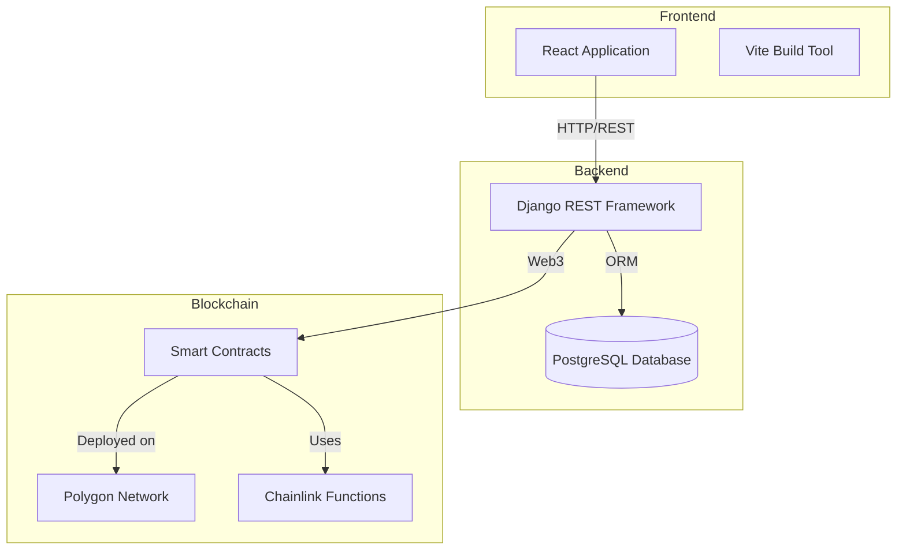
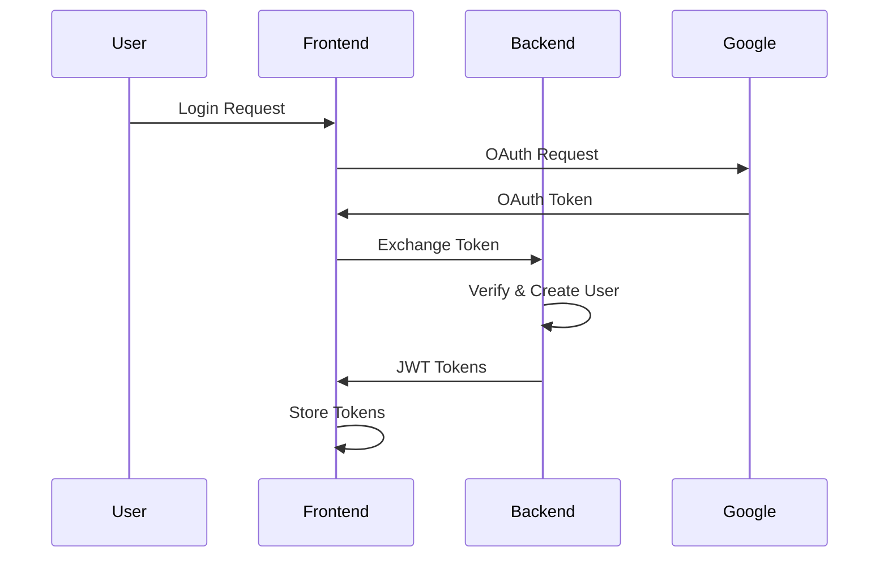
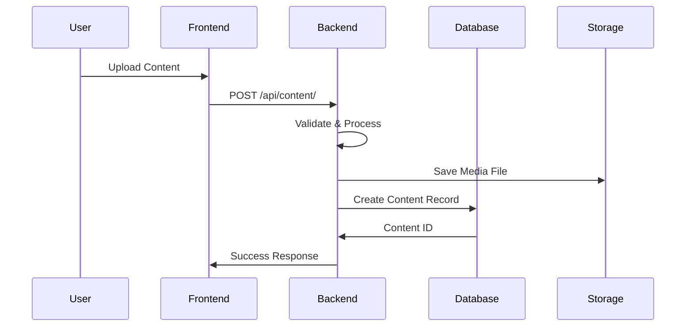
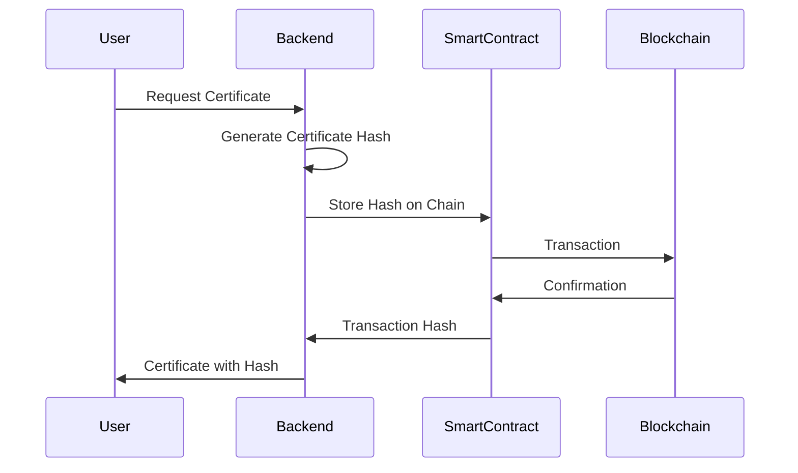

# System Architecture Overview

This document provides a high-level overview of the Sophia.AI Academia Blockchain platform architecture.

## System Components

The platform consists of three main components:



## Architecture Layers

### 1. Presentation Layer (Frontend)

**Technology**: React 18 + Vite 5

- **Purpose**: User interface and user experience
- **Key Features**:
  - Single Page Application (SPA)
  - Material-UI and Tailwind CSS for styling
  - React Router for navigation
  - Context API for state management
  - Axios for API communication

**Main Modules**:
- User authentication and profiles
- Content management and display
- Knowledge paths and quizzes
- Events and publications
- Messaging and notifications

### 2. Application Layer (Backend)

**Technology**: Django 5.0 + Django REST Framework

- **Purpose**: Business logic, API endpoints, and data processing
- **Key Features**:
  - RESTful API design
  - JWT authentication
  - Google OAuth integration
  - File upload and media management
  - Search functionality
  - Web3 integration for blockchain operations

**Main Django Apps**:
- `profiles` - User profiles and authentication
- `content` - Content management (videos, audio, text, images)
- `certificates` - Certificate generation and management
- `events` - Event management
- `knowledge_paths` - Learning paths and nodes
- `quizzes` - Quiz system
- `comments` - Comment system
- `votes` - Voting system
- `bookmarks` - Bookmarking
- `user_messages` - Messaging system
- `search` - Search functionality
- `notifications` - Notification system

### 3. Data Layer

**Technology**: PostgreSQL 15

- **Purpose**: Persistent data storage
- **Features**:
  - Relational database
  - ACID compliance
  - Foreign key relationships
  - Full-text search capabilities

### 4. Blockchain Layer

**Technology**: Solidity, Hardhat, Chainlink

- **Purpose**: Decentralized certification and verification
- **Components**:
  - Smart contracts for document certification
  - Chainlink Functions for external data
  - Polygon network for low-cost transactions
  - Web3.py for backend integration

## Data Flow

### User Authentication Flow



### Content Creation Flow



### Blockchain Certification Flow



## Technology Stack Summary

| Layer | Technology | Version |
|-------|-----------|---------|
| Frontend Framework | React | 18.3.1 |
| Build Tool | Vite | 5.2.0 |
| UI Libraries | Material-UI, Tailwind CSS | 6.4.3, 4.0.7 |
| Backend Framework | Django | 5.0 |
| API Framework | Django REST Framework | 3.15.2 |
| Database | PostgreSQL | 15 |
| Authentication | JWT, django-allauth | Simple JWT, 64.0.0 |
| Blockchain | Solidity, Hardhat | 0.8.24, 2.22.4 |
| Containerization | Docker, Docker Compose | Latest |

## Deployment Architecture

### Development Environment

```
┌─────────────────┐
│   React (5173)  │
└────────┬────────┘
         │
┌────────▼────────┐
│ Django (8000)   │
└────────┬────────┘
         │
┌────────▼────────┐
│  PostgreSQL     │
└─────────────────┘
```

### Production Environment

```
┌──────────────┐     ┌──────────────┐
│   Frontend   │────▶│   Backend    │
│   (Vite)     │     │   (Django)   │
└──────────────┘     └──────┬───────┘
                            │
                    ┌───────▼───────┐
                    │  PostgreSQL   │
                    └───────┬───────┘
                            │
                    ┌───────▼───────┐
                    │  AWS S3       │
                    │  (Media)      │
                    └───────────────┘
```

## Security Architecture

- **Authentication**: JWT tokens with refresh mechanism
- **Authorization**: Django permissions and custom decorators
- **CORS**: Configured for specific origins
- **CSRF**: Token-based protection
- **Data Validation**: Serializer validation and model constraints
- **Blockchain Security**: Smart contract access controls

## Scalability Considerations

- **Horizontal Scaling**: Stateless backend allows multiple instances
- **Database**: PostgreSQL supports read replicas
- **Caching**: Can be added with Redis
- **CDN**: Static files can be served via CDN
- **Blockchain**: Polygon network handles high transaction volume

## Related Documentation

- [Data Models](data-models.md) - Detailed database schema
- [API Design](api-design.md) - API architecture details
- [Blockchain Integration](blockchain-integration.md) - Web3 integration details
- [Deployment Guide](../deployment/production.md) - Production deployment

