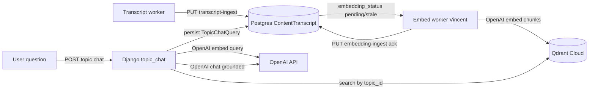

# Topic RAG and embeddings

Sophia uses **Qdrant Cloud** for transcript chunk vectors and **OpenAI** for query
embeddings and grounded chat answers. Django stores transcript text and
**embedding bookkeeping** in Postgres; it never stores raw vectors.

This document describes the end-to-end pipeline. API contracts live in the
operations docs linked at the bottom.

---

## Pipeline overview



| Stage | Who | Storage |
|-------|-----|---------|
| Transcript text | External transcript worker | Postgres `ContentTranscript` |
| Chunk vectors | External embed worker (Vincent) | Qdrant collection `sophia_acbc_topic_chunks` |
| Index metadata | Embed worker ack via Django API | Postgres `ContentTranscript.embedding_*` |
| User consultations | Django on chat POST | Postgres `TopicChatQuery` |

Vectors are **not** duplicated in Postgres. RAG retrieval reads Qdrant at
query time; citations use chunk `text` stored in Qdrant payloads (see
[qdrant-embeddings.md](../operations/qdrant-embeddings.md)).

---

## ContentTranscript embedding fields

| Field | Purpose |
|-------|---------|
| `text_hash` | SHA-256 of normalized transcript text (source of truth for staleness) |
| `embedding_status` | `pending` \| `indexed` \| `stale` \| `failed` \| `skipped` |
| `embedded_text_hash` | `text_hash` that was last successfully indexed |
| `embedding_model` | Model used on last successful index (e.g. `text-embedding-3-large`) |
| `embedding_dims` | Vector size (must match Qdrant collection, default **3072**) |
| `chunk_count` | Chunks upserted on last successful index |
| `embedded_at` | Timestamp of last successful ack |
| `embedding_error` | Last failure message when `status=failed` |

### Status lifecycle

On every transcript save (including transcript-ingest PUT), Django runs
`sync_embedding_status_for_text_hash()`:

- No `text_hash` → `pending`
- Never indexed (`embedded_text_hash` empty) → `pending`
- `text_hash == embedded_text_hash` and already `indexed` → unchanged
- `text_hash != embedded_text_hash` after a prior index → **`stale`** (re-embed required)
- `skipped` is **sticky** (seed data and manual skips are not auto-promoted)

Embed-worker acks (`PUT /api/content/embedding-ingest/{content_id}/`) set
`indexed`, `failed`, or `skipped` explicitly and bypass the save hook.

---

## Topic chat gating

Topic RAG (“Conversar”) is available when **all** of the following hold:

1. `Topic.chat_enabled` is `true` (moderator toggle; PATCH returns **400** if nothing is indexed yet).
2. At least one VIDEO/AUDIO in the topic has `embedding_status=indexed`
   (`Topic.indexed_transcript_count()`, exposed as `chat_can_enable` in API).
3. Runtime env: `OPENAI_API_KEY`, `QDRANT_URL`, and `QDRANT_API_KEY`.

The frontend shows the Conversar tab only when `chat_enabled && chat_can_enable`.

Staff see which topics have Conversar on `/dashboard` (section **Conversar**):
status, indexed-embedding count, and a switch to turn it on once Qdrant has
vectors for that topic.

Each chat POST is an **independent** consultation (`TopicChatQuery`). Previous
answers are not sent to the LLM. See [topic-rag-chat.md](../operations/topic-rag-chat.md).

---

## Models and code locations

| Piece | Location |
|-------|----------|
| `ContentTranscript` embedding fields | `acbc_app/content/models.py` |
| Staleness sync | `acbc_app/content/transcript_utils.py` |
| Embedding-ingest API | `acbc_app/content/views_embedding_ingest.py` |
| RAG orchestration | `acbc_app/content/topic_chat.py` |
| OpenAI client | `acbc_app/utils/openai_client.py` |
| Qdrant search client | `acbc_app/utils/qdrant_client.py` |
| Qdrant connectivity CLI | `acbc_app/content/management/commands/check_qdrant.py` |
| Frontend chat UI | `frontend/src/topics/TopicChat.jsx` |

---

## Environment variables

See [environment-variables.md](../deployment/environment-variables.md#qdrant-cloud-topic-embeddings)
for `QDRANT_*`, `OPENAI_*`, `TOPIC_CHAT_*`, and `TRANSCRIPT_INGEST_API_KEY`.

Quick verify:

```bash
cd acbc_app && . .venv/bin/activate
python manage.py check_qdrant --ensure-collection
python manage.py check_qdrant --topic-id 2   # optional point count
```

---

## External embed worker (Vincent)

Sophia does **not** ship the embed worker. Production setups use an external
process (internally called **Vincent**) that:

1. Polls `GET /api/content/embedding-ingest/topics/` to find topics with work
2. Polls `GET /api/content/embedding-ingest/?topic_id=<id>` for content in each topic
3. Reads `index_text` + `topic_ids` from the detail endpoint
4. Chunks, embeds with OpenAI, upserts to Qdrant
5. Acks via `PUT /api/content/embedding-ingest/{content_id}/`

Worker implementation and runbooks may live in a separate repository; Sophia’s
contract is defined in [qdrant-embeddings.md](../operations/qdrant-embeddings.md).

---

## Local dev caveat

Seed command `populate_content` sets `embedding_status=skipped` on demo
transcripts, so **Conversar will not appear** after seeding unless you either:

- Run the embed worker and ack items as `indexed`, or
- Manually ack a transcript via `PUT /api/content/embedding-ingest/{content_id}/` in dev.

Topic chat also requires valid Qdrant and OpenAI credentials in the backend env.

---

## Tests

| Test class | File |
|------------|------|
| `ContentEmbeddingIngestAPITests` | `acbc_app/content/tests.py` |
| `ContentTranscriptIngestAPITests` (stale on text change) | `acbc_app/content/tests.py` |
| `TopicChatAPITests` | `acbc_app/content/tests.py` |

---

## Related documentation

- [Qdrant embeddings + embed worker](../operations/qdrant-embeddings.md)
- [Topic RAG chat API](../operations/topic-rag-chat.md)
- [Transcript ingest](../api/transcript-ingest.md)
- [Data models — ContentTranscript](data-models.md#contenttranscript--transcriptanchor)
