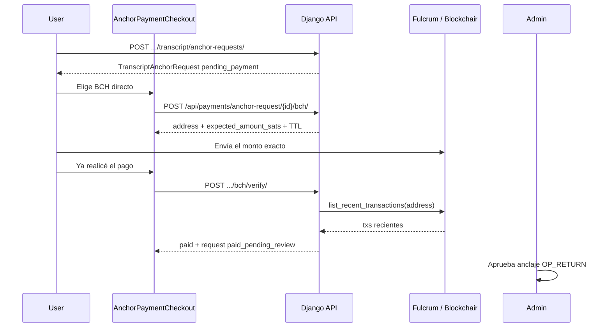

# Pago BCH directo (autocustodia) — anclaje de transcripts

Además de [NOWPayments](nowpayments-setup.md), Academia Blockchain puede cobrar el
precio fijo de una `TranscriptAnchorRequest` (`price_amount`, default
`ANCHOR_REQUEST_PRICE_USD`) en **Bitcoin Cash** hacia una wallet propia.

Cubre tres productos cuando tienen precio y la venta está activa
(`/dashboard/pagos-bch` → **En venta**):

- Solicitudes de anclaje (siempre, si hay dirección BCH en el servidor)
- Caminos de conocimiento con `reference_price > 0` y `sales_enabled`
- Consultas de un tema con `reference_price > 0` y `sales_enabled`

Cuando un camino/tema está **en venta**, el checkout ofrece NOWPayments (si está
configurado), Bitcoin Cash (si el servidor tiene dirección BCH) y Monero por
mensaje. El toggle del dashboard ya no activa BCH por producto: activa o pausa
la venta del contenido.

Eventos siguen en NOWPayments. Un camino de pago también puede seguir cobrando
por NOWPayments. El usuario puede cambiar de método mientras el invoice
NOWPayments sigue en `waiting` (aún no hay fondos en camino).

Índice de pagos: [README.md](README.md).

## Redes (igual que Bitcoin / signet)

| Entorno | Default `BCH_NETWORK` | Verificación | Prefijo CashAddr |
|---------|----------------------|--------------|------------------|
| `ENVIRONMENT` ≠ `PRODUCTION` (Docker local) | `chipnet` | Fulcrum/Electrum (`ssl://chipnet.bch.ninja:50002`) | `bchtest:` |
| `ENVIRONMENT=PRODUCTION` (servidor) | `mainnet` | Fulcrum Electrum `ssl://bch.imaginary.cash:50002` | `bitcoincash:` |

Override explícito: `BCH_NETWORK=chipnet` o `mainnet`. Chipnet es la red de pruebas
permanente de BCH (análogo práctico a signet para este flujo).

Faucet / explorer chipnet: [chipnet.chaingraph.cash](https://chipnet.chaingraph.cash/)

## Principios (alineados con el resto de pagos)

| Concepto | Implementación |
|----------|----------------|
| Entitlement | Solo `TranscriptAnchorRequest` (no eventos ni caminos) |
| Tras pagar | `paid_pending_review` vía `mark_anchor_request_paid()` (compartido con NOWPayments) |
| Admin | Aprueba/rechaza anclaje BTC como hoy (sin reembolso automático) |
| HTTP / SSL | Fulcrum/Electrum SSL (mainnet + chipnet); Blockchair HTTP opcional con API key |
| Workers / IPN BCH | No — el usuario pulsa **Ya realicé el pago** |

## Flujo



1. Usuario crea solicitud de anclaje (`pending_payment`).
2. Elige método: NOWPayments o BCH directo. Puede volver atrás y cambiar
   mientras el invoice NOWPayments esté en `waiting`.
3. BCH: backend asigna `expected_amount_sats` único (tasa USD→BCH, mínimo 1000 sats;
   desambiguación por ventana de tolerancia USD para no solapar órdenes concurrentes).
4. Usuario paga el monto mostrado a la dirección de la red activa (se tolera hasta
   `BCH_AMOUNT_TOLERANCE_USD`, default $0.20, por redondeo/fee de wallet).
5. `POST .../bch/verify/` consulta Fulcrum (o Blockchair si se fuerza); si hay match → orden `paid` + solicitud `paid_pending_review`.
   Si el indexer falla, el error se registra en logs y el UI ofrece **Avisar por mensaje**.
6. Admin emite el anclaje Bitcoin (OP_RETURN) desde Django admin (**Content → Transcript anchor requests**).

## Cómo se calcula el monto

1. Tasa USD/BCH: `BCH_USD_PRICE` si es `> 0`; si no, Blockchair mainnet `GET /stats` → `market_price_usd`, con fallback CoinGecko.
2. `bch_amount = ceil(usd / rate, 8 decimales)`.
3. `base_sats = bch_amount * 100_000_000`, luego `max(1000, base_sats)`.
4. Si otra orden `pending` no expirada cae dentro de la ventana de tolerancia de este monto,
   se desplaza el monto por `2 × tol_sats + 1` (hasta 10 000 intentos).

`tol_sats = ceil(BCH_AMOUNT_TOLERANCE_USD / usd_bch_rate × 1e8)` usando la tasa **congelada** de la orden.

El frontend muestra `expected_amount_bch` (8 decimales) y `expected_amount_sats`. El pagador debe
enviar ese monto; se aceptan desviaciones de hasta ~$0.20 al rate de la orden.
En checkout, un **QR** codifica solo la CashAddr (sin `amount=`), para evitar desajustes por fee/redondeo de wallets.

## Cómo se verifica (match on-chain)

Sin webhooks. `verify_bch_payment()` pide las ~30 txs más recientes de la dirección y acepta
el candidato **más cercano** a `expected_amount_sats` que cumpla:

| Regla | Detalle |
|-------|---------|
| Monto | `\|output.amount_sats − expected_amount_sats\| ≤ tol_sats` (`tol_sats` desde `usd_bch_rate` + `BCH_AMOUNT_TOLERANCE_USD`) |
| Dirección | CashAddr completa o payload tras `bitcoincash:` / `bchtest:` (case-insensitive) |
| Confirmaciones | `>= BCH_MIN_CONFIRMATIONS` (default `0` = mempool OK) |
| Reloj | `tx.timestamp >= created_at − grace` (default grace = `max(3600, TTL×60)` s; override `BCH_VERIFY_TIMESTAMP_GRACE_SECONDS`). Si el indexer no manda timestamp, no se filtra. |
| Txid único | `payment_txid` no puede repetirse en otra fila |
| Otras órdenes | Si otro `pending` está más cerca del monto pagado (y dentro de su tolerancia), no se reclama |

Si no hay match: `400` *No encontramos un pago BCH con un monto cercano al de la orden aún.*
El WARNING de borde HTTP incluye `expected_sats`, `amounts_seen`, `tol_sats`, skips, etc.

## Probe / debugging sin nuevo pago

```bash
cd acbc_app && . .venv/bin/activate
export ENVIRONMENT=DEVELOPMENT BCH_NETWORK=mainnet \
  BCH_RECEIVE_ADDRESS_MAINNET=bitcoincash:qpnq74gum4tstjat4803zav9lr37v5wqaqyqrh9wjd

# Look up a known buyer TXID against the receive address
python manage.py probe_bch_chain \
  --txid 4fd39e0a8c7836b7b10be30fcd213d21e2ed9a1fedd16dc8da77ca200e328d7a \
  --expected-sats 1945676

# Or list recent history only
python manage.py probe_bch_chain --limit 10
```

This talks to the same Electrum/Blockchair client as `verify_bch_payment` and does
**not** create or fulfill orders.

## Reuso, expiración y exclusión mutua

- Un `POST .../bch/` **reusa** la orden `pending` no expirada más reciente de esa solicitud.
- Filas `pending` con `expires_at` vencido pasan a `expired` (lazy, al crear/verificar).
- Otras `pending` viejas de la misma solicitud se marcan `cancelled` al crear una nueva.
- TTL: `max(5, BCH_PAYMENT_TTL_MINUTES)` minutos (default 30).
- Cambiar a BCH **abandona** invoices NOWPayments en `waiting` (marcados `expired`).
  Si el NOWPayments ya está en confirmación (`confirming` / `confirmed` / `sending` /
  `partially_paid`), BCH se bloquea hasta que ese pago termine o expire.
- Un BCH `pending` no bloquea abrir NOWPayments; el primer método que cumpla
  desbloquea el entitlement.

Estados de `BchDirectPayment`: `pending` → `paid` \| `expired` \| `cancelled`.

## Manual confirmation (staff dashboard)

If auto-verify fails or the order expires after the buyer already paid, they
report the **TXID** from checkout (support modal). That:

1. Stores the TXID on the order for the staff inbox
2. Sends **admins** an email + in-app notification (link → Pagos BCH)
3. Notifies the **product owner** (path author / topic creator) in-app
4. Still opens a message thread with support (user id 2)

Staff confirm from **Pagos Bitcoin Cash** (`/dashboard/pagos-bch`):

1. Open **Confirmar pagos reportados** (pending / expired / cancelled; reported first).
2. TXID is prefilled when the buyer already reported it — confirm after checking the explorer.
3. The API marks the `BchDirectPayment` as `paid` and unlocks the entitlement
   (`path` / `topic` / `anchor`) — no Django admin required.
4. For path/topic purchases, the **buyer** and **content owner** get in-app
   notifications when payment is confirmed (same on auto-verify).

| Método | Ruta | Auth |
|--------|------|------|
| POST | `/api/payments/bch-orders/<id>/report-txid/` | Buyer (`{ "txid": "…", "note": "…" }`) |
| GET | `/api/payments/admin/bch-orders/` | Staff |
| POST | `/api/payments/admin/bch-orders/<id>/confirm/` | Staff (`{ "txid": "…" }`) |

## Variables de entorno

```env
# Defaults: chipnet if ENVIRONMENT != PRODUCTION, else mainnet
# BCH_NETWORK=chipnet
# BCH_RECEIVE_ADDRESS_CHIPNET=bchtest:q...
# BCH_RECEIVE_ADDRESS_MAINNET=bitcoincash:q...
# Or a single fallback for the active network:
# BCH_RECEIVE_ADDRESS=bchtest:q...

# Optional overrides (defaults: Fulcrum Electrum for mainnet + chipnet):
# BCH_API_BASE=ssl://bch.imaginary.cash:50002
# BCH_API_BASE=ssl://chipnet.bch.ninja:50002
# BCH_API_BASE=https://api.blockchair.com/bitcoin-cash
# BCH_BLOCKCHAIR_API_KEY=

BCH_PAYMENT_TTL_MINUTES=30
BCH_MIN_CONFIRMATIONS=0
# Optional; default max(3600, TTL*60). Widen if buyers pay then recreate orders.
# BCH_VERIFY_TIMESTAMP_GRACE_SECONDS=3600
# Max |paid − expected| in USD at the order's frozen rate (default $0.20).
BCH_AMOUNT_TOLERANCE_USD=0.20
# 0 = fetch USD/BCH from Blockchair, then CoinGecko
BCH_USD_PRICE=0
ANCHOR_REQUEST_PRICE_USD=1
```

El método aparece en el checkout solo si hay dirección para la red activa
(`BCH_RECEIVE_ADDRESS_*` o `BCH_RECEIVE_ADDRESS`). Un prefijo CashAddr que no
coincide con la red se registra como warning; la verificación fallará después.

Referencia completa: [environment-variables.md](../deployment/environment-variables.md#bitcoin-cash-direct-anchor-request-payments).

## API

Todas las rutas BCH de anclaje requieren JWT (`IsAuthenticated`) salvo el status
público. El pagador debe ser el `requester`; el staff puede **consultar y
verificar**, no crear la orden.

| Método | Ruta | Auth | Respuesta |
|--------|------|------|-----------|
| GET | `/api/payments/status/` | Público | `bch_direct_enabled`, `bch_network`, `methods.bch_direct` |
| GET | `/api/payments/admin/bch-catalog/` | Staff | Caminos y temas + flags BCH |
| PATCH | `/api/payments/admin/knowledge-paths/<id>/` | Staff | `{ sales_enabled, reference_price }` |
| PATCH | `/api/payments/admin/topics/<id>/` | Staff | `{ sales_enabled, reference_price }` |
| GET | `/api/payments/anchor-request/<id>/bch/` | Requester o staff | `{ payment, bch_direct_enabled, bch_network, request? }` (`payment` puede ser `null`) |
| POST | `/api/payments/anchor-request/<id>/bch/` | Solo requester | Cuerpo del serializer (201). Reusa si hay orden viva. |
| POST | `/api/payments/anchor-request/<id>/bch/verify/` | Requester o staff | `{ payment, request }` |
| GET/POST | `/api/payments/path-purchase/<id>/bch/` | Comprador (POST) | Orden BCH del camino |
| POST | `/api/payments/path-purchase/<id>/bch/verify/` | Comprador o autor | `{ payment, purchase }` |
| GET/POST | `/api/payments/topic-purchase/<id>/bch/` | Comprador (POST) | Orden BCH de Consultas |
| POST | `/api/payments/topic-purchase/<id>/bch/verify/` | Comprador o moderador | `{ payment, purchase }` |

### Serializer (`BchDirectPayment`)

```json
{
  "id": 12,
  "anchor_request": 4,
  "address": "bitcoincash:q...",
  "expected_amount_sats": 500000,
  "expected_amount_bch": "0.00500000",
  "usd_amount": "1.00",
  "usd_bch_rate": "200.000000",
  "status": "pending",
  "network": "mainnet",
  "expires_at": "2026-09-02T22:40:00Z",
  "paid_at": null,
  "payment_txid": null,
  "is_expired": false,
  "seconds_remaining": 1680,
  "created_at": "2026-09-02T22:10:00Z",
  "updated_at": "2026-09-02T22:10:00Z"
}
```

`network` sale de `provider_payload.network` (al crear) o de `BCH_NETWORK`.

### Errores frecuentes

| HTTP | Cuándo |
|------|--------|
| 403 | No es el requester (POST crear) o no es requester/staff (GET/verify) |
| 404 | Solicitud inexistente |
| 400 | BCH no configurado; solicitud no `pending_payment`; NOWPayments en confirmación; orden expirada; sin match on-chain; tasa/monto inválido |
| 500 | Error inesperado al crear o verificar |

## Código

- Modelo: `payments.BchDirectPayment`
- Cliente: `payments/bch_client.py` (`build_bch_client()` → Electrum SSL por defecto; Blockchair HTTP si se fuerza)
elección chipnet/mainnet (Electrum) vs Blockchair explícito.
- CashAddr → scripthash: `payments/bch_cashaddr.py`
- Servicios: `payments/bch_services.py`
- Admin: `payments/admin.py` → **Payments → Bch direct payments**
- UI: `frontend/src/content/AnchorPaymentCheckout.jsx`
- Cliente HTTP: `frontend/src/api/paymentsApi.js`

## Tests

```bash
cd acbc_app && . .venv/bin/activate && ENVIRONMENT=DEVELOPMENT \
  python manage.py test payments.tests.BchDirectPaymentTests payments.tests.BchNetworkClientTests -v 1
```

Los tests mockean el cliente de cadena. No hace falta Blockchair, Fulcrum ni una
wallet real. Cubren monto único, reuso, match exacto, rechazo por sat de más, y
elección Electrum (default) vs Blockchair explícito.
