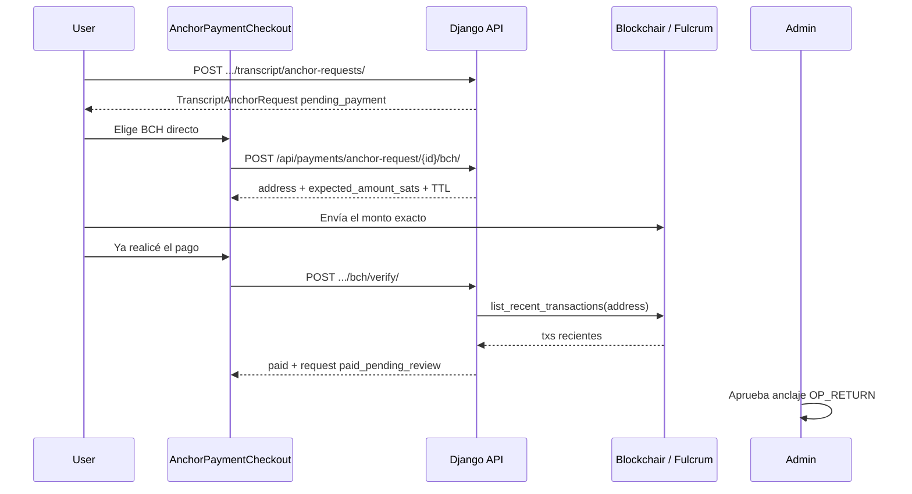

# Pago BCH directo (autocustodia) — anclaje de transcripts

Además de [NOWPayments](nowpayments-setup.md), Academia Blockchain puede cobrar el
precio fijo de una `TranscriptAnchorRequest` (`price_amount`, default
`ANCHOR_REQUEST_PRICE_USD`) en **Bitcoin Cash** hacia una wallet propia.

Cubre tres productos cuando el staff los activa en el dashboard
(`/dashboard/pagos-bch`):

- Solicitudes de anclaje (siempre, si hay dirección BCH en el servidor)
- Caminos de conocimiento con `reference_price > 0` y `bch_direct_enabled`
- Consultas de un tema con `reference_price > 0` y `bch_direct_enabled`

Eventos siguen en NOWPayments. Un camino de pago también puede seguir cobrando
por NOWPayments. El usuario puede cambiar de método mientras el invoice
NOWPayments sigue en `waiting` (aún no hay fondos en camino).

Índice de pagos: [README.md](README.md).

## Redes (igual que Bitcoin / signet)

| Entorno | Default `BCH_NETWORK` | Verificación | Prefijo CashAddr |
|---------|----------------------|--------------|------------------|
| `ENVIRONMENT` ≠ `PRODUCTION` (Docker local) | `chipnet` | Fulcrum/Electrum (`ssl://chipnet.bch.ninja:50002`) | `bchtest:` |
| `ENVIRONMENT=PRODUCTION` (servidor) | `mainnet` | Blockchair `https://api.blockchair.com/bitcoin-cash` | `bitcoincash:` |

Override explícito: `BCH_NETWORK=chipnet` o `mainnet`. Chipnet es la red de pruebas
permanente de BCH (análogo práctico a signet para este flujo).

Faucet / explorer chipnet: [chipnet.chaingraph.cash](https://chipnet.chaingraph.cash/)

## Principios (alineados con el resto de pagos)

| Concepto | Implementación |
|----------|----------------|
| Entitlement | Solo `TranscriptAnchorRequest` (no eventos ni caminos) |
| Tras pagar | `paid_pending_review` vía `mark_anchor_request_paid()` (compartido con NOWPayments) |
| Admin | Aprueba/rechaza anclaje BTC como hoy (sin reembolso automático) |
| HTTP / SSL | Blockchair (mainnet) o Electrum SSL (chipnet); sin workers/IPN BCH |
| Workers / IPN BCH | No — el usuario pulsa **Ya realicé el pago** |

## Flujo



1. Usuario crea solicitud de anclaje (`pending_payment`).
2. Elige método: NOWPayments o BCH directo. Puede volver atrás y cambiar
   mientras el invoice NOWPayments esté en `waiting`.
3. BCH: backend asigna `expected_amount_sats` único (tasa USD→BCH, mínimo 1000 sats, desambiguación +1 sat).
4. Usuario paga el monto **exacto** a la dirección de la red activa.
5. `POST .../bch/verify/` consulta Blockchair o Fulcrum; si hay match → orden `paid` + solicitud `paid_pending_review`.
6. Admin emite el anclaje Bitcoin (OP_RETURN) desde Django admin (**Content → Transcript anchor requests**).

## Cómo se calcula el monto

1. Tasa USD/BCH: `BCH_USD_PRICE` si es `> 0`; si no, Blockchair mainnet `GET /stats` → `market_price_usd` (también en chipnet, porque chipnet no tiene mercado).
2. `bch_amount = ceil(usd / rate, 8 decimales)`.
3. `base_sats = bch_amount * 100_000_000`, luego `max(1000, base_sats)`.
4. Si otra orden `pending` no expirada ya usa esos sats, se suma **1 sat** (hasta 10 000 intentos).

El frontend muestra `expected_amount_bch` (8 decimales) y `expected_amount_sats`. El pagador debe enviar **exactamente** esos sats; un sat de más o de menos no cuenta.

## Cómo se verifica (match on-chain)

Sin webhooks. `verify_bch_payment()` pide las ~30 txs más recientes de la dirección y acepta la primera que cumpla todo:

| Regla | Detalle |
|-------|---------|
| Monto exacto | `output.amount_sats == expected_amount_sats` |
| Dirección | CashAddr completa o payload tras `bitcoincash:` / `bchtest:` (case-insensitive) |
| Confirmaciones | `>= BCH_MIN_CONFIRMATIONS` (default `0` = mempool OK) |
| Reloj | `tx.timestamp >= created_at − 60s` (si el indexer no manda timestamp, no se filtra) |
| Txid único | `payment_txid` no puede repetirse en otra fila |

Si no hay match: `400` *No encontramos un pago BCH con el monto exacto aún.*

## Reuso, expiración y exclusión mutua

- Un `POST .../bch/` **reusa** la orden `pending` no expirada más reciente de esa solicitud.
- Filas `pending` con `expires_at` vencido pasan a `expired` (lazy, al crear/verificar).
- Otras `pending` viejas de la misma solicitud se marcan `cancelled` al crear una nueva.
- TTL: `max(5, BCH_PAYMENT_TTL_MINUTES)` minutos (default 30).
- Cambiar a BCH **abandona** invoices NOWPayments en `waiting` (marcados `expired`).
  Si el NOWPayments ya está en confirmación (`confirming` / `confirmed` / `sending` /
  `partially_paid`), BCH se bloquea hasta que ese pago termine o expire.
- Un BCH `pending` no bloquea abrir NOWPayments; el primer método que cumpla
  desbloquea el entitlement.

Estados de `BchDirectPayment`: `pending` → `paid` \| `expired` \| `cancelled`.

## Variables de entorno

```env
# Defaults: chipnet if ENVIRONMENT != PRODUCTION, else mainnet
# BCH_NETWORK=chipnet
# BCH_RECEIVE_ADDRESS_CHIPNET=bchtest:q...
# BCH_RECEIVE_ADDRESS_MAINNET=bitcoincash:q...
# Or a single fallback for the active network:
# BCH_RECEIVE_ADDRESS=bchtest:q...

# Optional overrides (defaults follow BCH_NETWORK):
# BCH_API_BASE=ssl://chipnet.bch.ninja:50002
# BCH_API_BASE=https://api.blockchair.com/bitcoin-cash

BCH_PAYMENT_TTL_MINUTES=30
BCH_MIN_CONFIRMATIONS=0
# 0 = fetch USD/BCH from Blockchair mainnet /stats (also used to size chipnet orders)
BCH_USD_PRICE=0
ANCHOR_REQUEST_PRICE_USD=1
```

El método aparece en el checkout solo si hay dirección para la red activa
(`BCH_RECEIVE_ADDRESS_*` o `BCH_RECEIVE_ADDRESS`). Un prefijo CashAddr que no
coincide con la red se registra como warning; la verificación fallará después.

Referencia completa: [environment-variables.md](../deployment/environment-variables.md#bitcoin-cash-direct-anchor-request-payments).

## API

Todas las rutas BCH de anclaje requieren JWT (`IsAuthenticated`) salvo el status
público. El pagador debe ser el `requester`; el staff puede **consultar y
verificar**, no crear la orden.

| Método | Ruta | Auth | Respuesta |
|--------|------|------|-----------|
| GET | `/api/payments/status/` | Público | `bch_direct_enabled`, `bch_network`, `methods.bch_direct` |
| GET | `/api/payments/admin/bch-catalog/` | Staff | Caminos y temas + flags BCH |
| PATCH | `/api/payments/admin/knowledge-paths/<id>/` | Staff | `{ bch_direct_enabled }` |
| PATCH | `/api/payments/admin/topics/<id>/` | Staff | `{ bch_direct_enabled, reference_price }` |
| GET | `/api/payments/anchor-request/<id>/bch/` | Requester o staff | `{ payment, bch_direct_enabled, bch_network, request? }` (`payment` puede ser `null`) |
| POST | `/api/payments/anchor-request/<id>/bch/` | Solo requester | Cuerpo del serializer (201). Reusa si hay orden viva. |
| POST | `/api/payments/anchor-request/<id>/bch/verify/` | Requester o staff | `{ payment, request }` |
| GET/POST | `/api/payments/path-purchase/<id>/bch/` | Comprador (POST) | Orden BCH del camino |
| POST | `/api/payments/path-purchase/<id>/bch/verify/` | Comprador o autor | `{ payment, purchase }` |
| GET/POST | `/api/payments/topic-purchase/<id>/bch/` | Comprador (POST) | Orden BCH de Consultas |
| POST | `/api/payments/topic-purchase/<id>/bch/verify/` | Comprador o moderador | `{ payment, purchase }` |

### Serializer (`BchDirectPayment`)

```json
{
  "id": 12,
  "anchor_request": 4,
  "address": "bitcoincash:q...",
  "expected_amount_sats": 500000,
  "expected_amount_bch": "0.00500000",
  "usd_amount": "1.00",
  "usd_bch_rate": "200.000000",
  "status": "pending",
  "network": "mainnet",
  "expires_at": "2026-09-02T22:40:00Z",
  "paid_at": null,
  "payment_txid": null,
  "is_expired": false,
  "seconds_remaining": 1680,
  "created_at": "2026-09-02T22:10:00Z",
  "updated_at": "2026-09-02T22:10:00Z"
}
```

`network` sale de `provider_payload.network` (al crear) o de `BCH_NETWORK`.

### Errores frecuentes

| HTTP | Cuándo |
|------|--------|
| 403 | No es el requester (POST crear) o no es requester/staff (GET/verify) |
| 404 | Solicitud inexistente |
| 400 | BCH no configurado; solicitud no `pending_payment`; NOWPayments en confirmación; orden expirada; sin match on-chain; tasa/monto inválido |
| 500 | Error inesperado al crear o verificar |

## Código

- Modelo: `payments.BchDirectPayment`
- Cliente: `payments/bch_client.py` (`build_bch_client()` → Blockchair HTTP o Electrum SSL)
- CashAddr → scripthash: `payments/bch_cashaddr.py`
- Servicios: `payments/bch_services.py`
- Admin: `payments/admin.py` → **Payments → Bch direct payments**
- UI: `frontend/src/content/AnchorPaymentCheckout.jsx`
- Cliente HTTP: `frontend/src/api/paymentsApi.js`

## Tests

```bash
cd acbc_app && . .venv/bin/activate && ENVIRONMENT=DEVELOPMENT \
  python manage.py test payments.tests.BchDirectPaymentTests payments.tests.BchNetworkClientTests -v 1
```

Los tests mockean el cliente de cadena. No hace falta Blockchair, Fulcrum ni una
wallet real. Cubren monto único, reuso, match exacto, rechazo por sat de más, y
elección chipnet (Electrum) vs mainnet (Blockchair).
