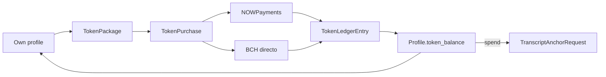

# Platform tokens (buy, hold, and spend on anchors)

Platform-only credits sold in packages. They are **not** a cryptocurrency and do not live on-chain.

Index: [README.md](README.md).

## What users see

Own profile only (`/profiles/my_profile?section=tokens`):

- Header chip with the current balance
- **Mis tokens** section: explanation, package cards, NOWPayments + Bitcoin Cash checkout (no Monero), recent purchases

Staff edit packages in Django admin (`Token packages`). Face value is **1 token = $0.01 USD** (`PLATFORM_TOKEN_USD_PRICE`). Seeded catalog: 100 / 300 / 800 tokens ($1 / $3 / $8).

## Spending today

| Product | Price | Tokens (0% discount) |
|---------|-------|----------------------|
| Transcript Bitcoin anchor (`TranscriptAnchorRequest`) | `$ANCHOR_REQUEST_PRICE_USD` (default `$1`) | 100 |

Pay with tokens: `POST /api/payments/anchor-request/<id>/tokens/`. Marks the request `paid_pending_review` (same as NOWPayments / BCH). Staff still approve the Bitcoin broadcast in admin.

`TOKEN_CONTENT_DISCOUNT_PERCENT` reduces the token cost (e.g. `10` → 90 tokens for a $1 anchor). Spending on paths, Consultas, and events is still a later phase.

## Data

| Model | Role |
|-------|------|
| `TokenPackage` | SKU: name, `token_amount`, `usd_price`, `is_active`, `sort_order` |
| `TokenPurchase` | One checkout attempt (`PENDING` / `PAID` / `REFUNDED`). Same package can be bought many times. Snapshots amount and USD price. |
| `TokenLedgerEntry` | Append-only movements (`purchase`, `adjustment`, `spend`). Unique purchase credit per `TokenPurchase`; unique spend per `TranscriptAnchorRequest`. |
| `Profile.token_balance` | Cached non-negative integer. Mutated only by `credit_platform_tokens` / `debit_platform_tokens`. |

`CryptoPayment` and `BchDirectPayment` XOR targets include `token_purchase`. Fulfillment (`mark_token_purchase_paid`) credits the ledger once (NOWPayments IPN/poll, BCH verify, or staff TXID confirm).

## API

Authenticated, under `/api/payments/`:

| Method | Route |
|--------|--------|
| GET | `token-packages/` |
| GET/POST | `token-purchases/` |
| POST | `token-purchase/{id}/` (NOWPayments invoice) |
| GET | `token-purchase/{id}/list/` |
| GET/POST | `token-purchase/{id}/bch/` |
| POST | `token-purchase/{id}/bch/verify/` |
| POST | `anchor-request/{id}/tokens/` (spend on Bitcoin anchor) |

`POST /api/payments/bch-orders/{id}/report-txid/` and staff confirm work for these BCH orders like other products (`product_type: token_package`).

Own-profile `GET /api/profiles/user_profile/` includes `token_balance`. Other users' profiles return `token_balance: null`.
