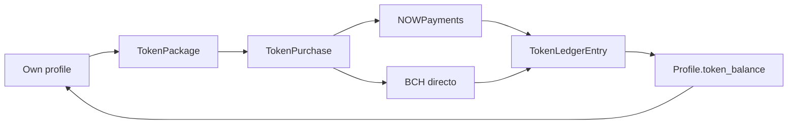

# Platform tokens (buy and hold)

Platform-only credits sold in packages. They are **not** a cryptocurrency and do not live on-chain. v1 is buy, credit, and display: users cannot yet spend tokens on content.

Index: [README.md](README.md).

## What users see

Own profile only (`/profiles/my_profile?section=tokens`):

- Header chip with the current balance
- **Mis tokens** section: explanation, package cards, NOWPayments + Bitcoin Cash checkout (no Monero), recent purchases

Staff edit packages in Django admin (`Token packages`). Seeded catalog (changeable): 100 / 300 / 800 tokens.

## Data

| Model | Role |
|-------|------|
| `TokenPackage` | SKU: name, `token_amount`, `usd_price`, `is_active`, `sort_order` |
| `TokenPurchase` | One checkout attempt (`PENDING` / `PAID` / `REFUNDED`). Same package can be bought many times. Snapshots amount and USD price. |
| `TokenLedgerEntry` | Append-only movements (`purchase`, `adjustment`, later `spend`). Unique purchase credit per `TokenPurchase`. |
| `Profile.token_balance` | Cached non-negative integer. Mutated only by `credit_platform_tokens`. |

`CryptoPayment` and `BchDirectPayment` XOR targets now include `token_purchase`. Fulfillment (`mark_token_purchase_paid`) credits the ledger once (NOWPayments IPN/poll, BCH verify, or staff TXID confirm).

Spending on paths, Consultas, events, and transcript anchors is a later phase. `TOKEN_CONTENT_DISCOUNT_PERCENT` is reserved in settings (unused in v1).

## API

Authenticated, under `/api/payments/`:

| Method | Route |
|--------|--------|
| GET | `token-packages/` |
| GET/POST | `token-purchases/` |
| POST | `token-purchase/{id}/` (NOWPayments invoice) |
| GET | `token-purchase/{id}/list/` |
| GET/POST | `token-purchase/{id}/bch/` |
| POST | `token-purchase/{id}/bch/verify/` |

`POST /api/payments/bch-orders/{id}/report-txid/` and staff confirm work for these BCH orders like other products (`product_type: token_package`).

Own-profile `GET /api/profiles/user_profile/` includes `token_balance`. Other users' profiles return `token_balance: null`.
