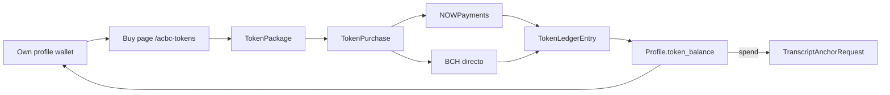

# Platform tokens (buy, hold, and spend on anchors)

Platform-only credits sold in packages. They are **not** a cryptocurrency and do not live on-chain.

Index: [README.md](README.md).

## What users see

Wallet on own profile (`/profiles/my_profile?section=tokens`):

- Header chip with the current balance (links here)
- **Mis tokens**: balance, short explanation, activity, resume pending payment
- Primary CTA to the shop

Shop (`/acbc-tokens`, signed-in):

- What tokens are (platform credits, not a cryptocurrency; cannot withdraw)
- Benefits: later discount on knowledge paths, topic Consultas, events, and transcript anchors
- Package cards and NOWPayments + Bitcoin Cash checkout (no Monero)

Staff edit packages in Django admin (`Token packages`). Face value is **1 token = $0.01 USD** (`PLATFORM_TOKEN_USD_PRICE`); `usd_price` must equal paid `token_amount × $0.01`. Larger SKUs may include free `bonus_tokens`. Seeded catalog:

| Package | Paid | Bonus | Credited | USD |
|---------|------|-------|----------|-----|
| 300 tokens | 300 | 0 | 300 | $3 |
| 800 tokens + 50 bonus | 800 | 50 | 850 | $8 |
| 1200 tokens + 200 bonus | 1200 | 200 | 1400 | $12 |

## Spending today

| Product | Price | Tokens (0% discount) |
|---------|-------|----------------------|
| Transcript Bitcoin anchor (`TranscriptAnchorRequest`) | `$ANCHOR_REQUEST_PRICE_USD` (default `$1`) | 100 |

Pay with tokens: `POST /api/payments/anchor-request/<id>/tokens/`. Marks paid and triggers automatic Bitcoin broadcast (same as NOWPayments / BCH). `paid_pending_review` only if broadcast is deferred.

`TOKEN_CONTENT_DISCOUNT_PERCENT` reduces the token cost (e.g. `10` → 90 tokens for a $1 anchor). Spending on paths, Consultas, and events is still a later phase.

## Data

| Model | Role |
|-------|------|
| `TokenPackage` | SKU: name, `token_amount` (paid), `bonus_tokens`, `usd_price`, `is_active`, `sort_order` |
| `TokenPurchase` | One checkout attempt (`PENDING` / `PAID` / `REFUNDED`). Same package can be bought many times. Snapshots paid amount, bonus, and USD price. Credits `token_amount + bonus_tokens`. |
| `TokenLedgerEntry` | Append-only movements (`purchase`, `adjustment`, `spend`). Unique purchase credit per `TokenPurchase`; unique spend per `TranscriptAnchorRequest`. |
| `Profile.token_balance` | Cached non-negative integer. Mutated only by `credit_platform_tokens` / `debit_platform_tokens`. |

`CryptoPayment` and `BchDirectPayment` XOR targets include `token_purchase`. Fulfillment (`mark_token_purchase_paid`) credits the ledger once (NOWPayments IPN/poll, BCH verify, or staff TXID confirm).

### Consultas daily limit (current UX, no spend yet)

Topic Consultas still use a **free-tier daily cap** of 3 per logged-in user (see [topic-rag-chat.md](../operations/topic-rag-chat.md#access-and-free-tier-quota)):

1. Guests cannot create consultations (**401** / login prompt).
2. Logged-in users get up to 3 consultations per calendar day.
3. When the cap is hit, the Consultas UI prompts them to buy tokens via **Ir a Mis tokens** (`/profiles/my_profile?section=tokens`).

Owning tokens does **not** raise that cap yet. Wiring `Profile.token_balance` (or a spend) into `user_daily_consultation_limit` is future work; the CTA is in place so the purchase path is ready.

## API

Authenticated, under `/api/payments/`:

| Method | Route |
|--------|--------|
| GET | `token-packages/` |
| GET/POST | `token-purchases/` |
| POST | `token-purchase/{id}/` (NOWPayments invoice) |
| GET | `token-purchase/{id}/list/` |
| GET/POST | `token-purchase/{id}/bch/` |
| POST | `token-purchase/{id}/bch/verify/` |
| POST | `anchor-request/{id}/tokens/` (spend on Bitcoin anchor) |

`POST /api/payments/bch-orders/{id}/report-txid/` and staff confirm work for these BCH orders like other products (`product_type: token_package`).

Own-profile `GET /api/profiles/user_profile/` includes `token_balance`. Other users' profiles return `token_balance: null`.
